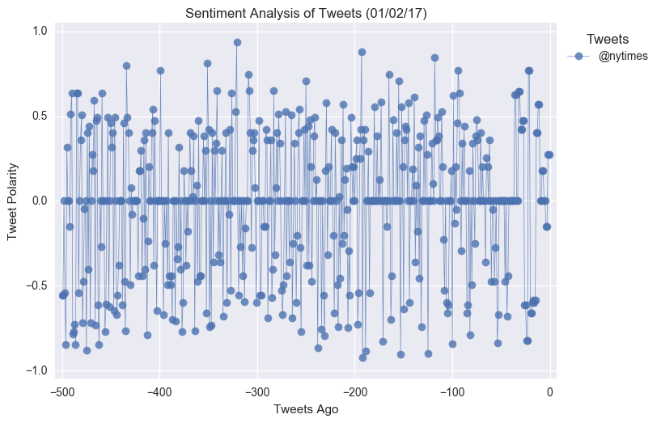

## PlotBot

  

# Objective

In this activity, more challenging than the last, I will build a Twitter bot that sends out visualized sentiment analysis of a Twitter account's recent tweets.

The bot receives tweets via mentions and in turn performs sentiment analysis on the most recent twitter account specified in the mention

For example, when a user tweets, __"@PlotBot Analyze: @CNN,"__ it will trigger a sentiment analysis on the CNN twitter feed.

A plot from the sentiment analysis is then tweeted to the PlotBot's twitter feed. See below for examples of scatter plots you will generate:

  

  

  

Hints, requirements, and considerations:

* The bot should scan it's account every __five minutes__ for mentions.
* The bot should pull 500 most recent tweets to analyze for each incoming request.
* The plot should include meaningful legend and labels.
* It should also mention the Twitter account name of the requesting user.
* Notable libraries used to complete this application include: Matplotlib, Pandas, Tweepy, TextBlob, and Seaborn.

---

---

# Solution

## Sample Bot Twitter Page

# [Click Here to Navigate to @PlotBot7's Twitter Page](https://twitter.com/PlotBot7)
